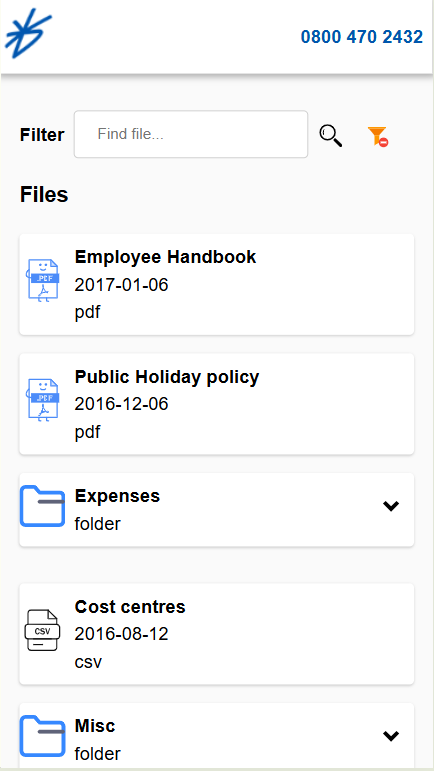
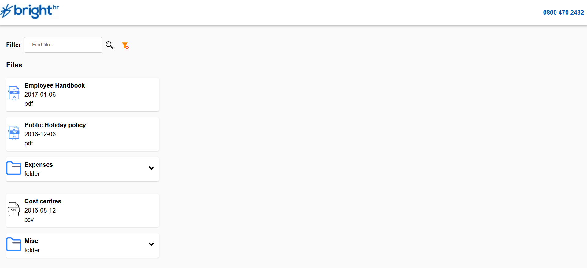

# File Explorer App for BrightHR

## Table of contents

- [Overview](#overview)
  - [Screenshot](#screenshot)
  - [The project](#the-project)
  - [Expected behaviour](#expected-behaviour)
  - [Links](#links)
- [Built with](#built-with)
- [Continued development](#continued-development)
- [How to run the application](#how to run the application)

### Screenshot

### The Project

Your users should be able to:
For each file show at least:

File type
Name
Date added
For each folder indicate that it's not a file and is clickable.

Please add at least two of the following features:

Allow a user to open a folder to see it’s contents
Sort by name/size/date
Filter by filename

- View the optimal layout for the app depending on their device's screen size
- View the mobile BrightHR logo on mobile devices and Desktop logo on larger devices
- For each file show at least: File type, Name, Date added
- Allow a user to open a folder to see it’s contents
- Filter by filename

### Expected Behaviour

- View the optimal layout for the app depending on their device's screen size
  - Regardless of the user device, the web app should display the content in the correct order without any out of bound or
    not proportionate content.
- View the mobile BrightHR logo on mobile devices and Desktop logo on larger devices
  - If the user is on a mobile screen, the logo should be the symbolic mobile screen one. If the user is using any larger devices, the user should see the Desktop version.
- For each file show at least: File type, Name, Date added
- Allow a user to open a folder to see it’s contents
- Filter by filename
- The user should be able to filter only files by name. If the query is invalid, the user should see a no results found to prompt the user. Also, there should be a button/icon to allow the user to clear the query.

### Links

- Solution URL: [Github](https://github.com/bilanoo/files-explorer-brhr)
- Live Site URL: [File Explorer by BrightHR](https://invoice-app-by-bilal-khan.netlify.app)

### Built with

- [React](https://react.dev/)
- [Typescript](https://www.typescriptlang.org/docs/)
- [CSS](https://developer.mozilla.org/en-US/docs/Web/CSS)
- [Flexbox](https://developer.mozilla.org/en-US/docs/Web/CSS/CSS_flexible_box_layout/Basic_concepts_of_flexbox)
- [React Testing Library](https://testing-library.com/docs/react-testing-library/intro/)
- [Jest](https://jestjs.io/docs/getting-started)

### Continued development

Add additional features like being able to filter based on name/size/date.

### How to run the application

Please on a terminal use the following command: `npm install` and then run `npm run dev`.
